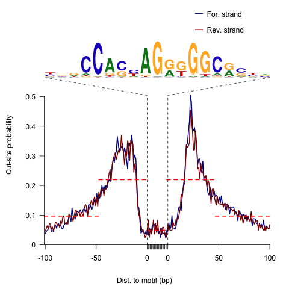

```{r, echo=FALSE, results="hide", warning=FALSE, message=FALSE}
suppressPackageStartupMessages({
  library(ATACseqQC)
  library(ChIPpeakAnno)
  library(BSgenome.Hsapiens.UCSC.hg19)
  library(TxDb.Hsapiens.UCSC.hg19.knownGene)
  library(phastCons100way.UCSC.hg19)
  library(MotifDb)
  library(GenomicAlignments)
})
knitr::opts_chunk$set(warning=FALSE, message=FALSE)
```

# Introduction

Assay for Transposase-Accessible Chromatin using sequencing 
(ATAC-seq) is an alternative or complementary technique to MNase-seq, DNase-seq, 
and FAIRE-seq for chromatin accessibility analysis. The results 
obtained from ATAC-seq are similar to those from DNase-seq and FAIRE-seq. 
ATAC-seq is gaining popularity because it does not require cross-linking, 
has higher signal to noise ratio, requires a much smaller amount of biological 
material and is faster and easier to perform, compared to other techniques [@buenrostro2013transposition]. 

To help researchers quickly assess the quality of  ATAC-seq data, we 
have developed the ATACseqQC package for easily making diagnostic plots 
following the published guidelines [@buenrostro2013transposition]. 
In addition, it has functions to preprocess ATACseq data for 
subsequent peak calling.

# Quick start

Here is an example using ATACseqQC with a subset of published ATAC-seq 
data[@buenrostro2013transposition]. Currently, only bam input file 
format is supported.

First install ATACseqQC and other packages required to run the examples. Please note that the example dataset used here is from human. To run analysis with dataset from a different species or differnt assembly, please install the corresponding BSgenome, TxDb and phastCons. For example, to analyze mouse data aligned to mm10, please install BSgenome.Mmusculus.UCSC.mm10, TxDb.Mmusculus.UCSC.mm10.knownGene and phastCons60way.UCSC.mm10. Please note that phstCons60way.UCSC.mm10 is optional, which can be obtained according to the vignettes of GenomicScores. 

```{r, eval=FALSE}
library(BiocManager)
BiocManager::install(c("ATACseqQC", "ChIPpeakAnno", "MotifDb", "GenomicAlignments",
           "BSgenome.Hsapiens.UCSC.hg19", "TxDb.Hsapiens.UCSC.hg19.knownGene",
           "phastCons100way.UCSC.hg19"))
```

```{r}
## load the library
library(ATACseqQC)
## input the bamFile from the ATACseqQC package 
bamfile <- system.file("extdata", "GL1.bam", 
                        package="ATACseqQC", mustWork=TRUE)
bamfile.labels <- gsub(".bam", "", basename(bamfile))
```

## IGV snapshot

Source code of IGVSnapshot function is available in extdata folder. To call the function, please try

```{r, eval=FALSE}
source(system.file("extdata", "IGVSnapshot.R", package = "ATACseqQC"))
```


## Estimate the library complexity

```{r}
#bamQC(bamfile, outPath=NULL)
estimateLibComplexity(readsDupFreq(bamfile))
```

## Fragment size distribution

First, there should be a large proportion of reads with less 
than 100 bp, which represents the nucleosome-free region. 
Second, the fragment size distribution should have a clear 
periodicity, which is evident in the inset figure, indicative of 
nucleosome occupacy (present in integer multiples).

```{r}
## generate fragement size distribution
fragSize <- fragSizeDist(bamfile, bamfile.labels)
```

## Nucleosome positioning

### Adjust the read start sites

Tn5 transposase has been shown to bind as a dimer and 
inserts two adaptors into accessible DNA locations separated by 9 bp [@adey2010rapid].

Therefore, for downstream analysis, such as peak-calling and footprinting,
all reads in input bamfile need to be shifted. 
The function `shiftGAlignmentsList` can be used to shift the reads. 
By default, all reads aligning to the positive strand are offset by +4bp, 
and all reads aligning to the negative strand are offset by -5bp [@buenrostro2013transposition]. 

The adjusted reads will be written into a new bamfile for peak calling or 
footprinting.

```{r}
## bamfile tags to be read in
possibleTag <- list("integer"=c("AM", "AS", "CM", "CP", "FI", "H0", "H1", "H2", 
                                "HI", "IH", "MQ", "NH", "NM", "OP", "PQ", "SM",
                                "TC", "UQ"), 
                 "character"=c("BC", "BQ", "BZ", "CB", "CC", "CO", "CQ", "CR",
                               "CS", "CT", "CY", "E2", "FS", "LB", "MC", "MD",
                               "MI", "OA", "OC", "OQ", "OX", "PG", "PT", "PU",
                               "Q2", "QT", "QX", "R2", "RG", "RX", "SA", "TS",
                               "U2"))
library(Rsamtools)
bamTop100 <- scanBam(BamFile(bamfile, yieldSize = 100),
                     param = ScanBamParam(tag=unlist(possibleTag)))[[1]]$tag
tags <- names(bamTop100)[lengths(bamTop100)>0]
tags
## files will be output into outPath
outPath <- "splited"
dir.create(outPath)
## shift the coordinates of 5'ends of alignments in the bam file
library(TxDb.Hsapiens.UCSC.hg19.knownGene)
## if you don't have an available TxDb, please refer
## GenomicFeatures::makeTxDbFromGFF to create one from gff3 or gtf file.
seqlev <- "chr1" ## subsample data for quick run
seqinformation <- seqinfo(TxDb.Hsapiens.UCSC.hg19.knownGene)
which <- as(seqinformation[seqlev], "GRanges")
gal <- readBamFile(bamfile, tag=tags, which=which, asMates=TRUE, bigFile=TRUE)
shiftedBamfile <- file.path(outPath, "shifted.bam")
gal1 <- shiftGAlignmentsList(gal, outbam=shiftedBamfile)
```

### Promoter/Transcript body (PT) score

PT score is calculated as the coverage of promoter divided by the coverage of its transcript body.
PT score will show if the signal is enriched in promoters.
```{r}
library(TxDb.Hsapiens.UCSC.hg19.knownGene)
txs <- transcripts(TxDb.Hsapiens.UCSC.hg19.knownGene)
pt <- PTscore(gal1, txs)
plot(pt$log2meanCoverage, pt$PT_score, 
     xlab="log2 mean coverage",
     ylab="Promoter vs Transcript")
```


### Nucleosome Free Regions (NFR) score

NFR score is a ratio between cut signal adjacent to TSS and that flanking the corresponding TSS.
Each TSS window of 400 bp is first divided into 3 sub-regions: the most upstream 150 bp (n1), 
the most downstream of 150 bp (n2), and the middle 100 bp (nf). 
Then the number of fragments with 5' ends overlapping each region are calculated for each TSS.
The NFR score for each TSS is calculated as NFR-score = log2(nf) - log2((n1+n2)/2). 
A plot can be generated with the NFR scores as Y-axis and the average signals of 400 bp window as X-axis, 
very like a MA plot for gene expression data. 

```{r}
nfr <- NFRscore(gal1, txs)
plot(nfr$log2meanCoverage, nfr$NFR_score, 
     xlab="log2 mean coverage",
     ylab="Nucleosome Free Regions score",
     main="NFRscore for 200bp flanking TSSs",
     xlim=c(-10, 0), ylim=c(-5, 5))
```


### Transcription Start Site (TSS) Enrichment Score

TSS enrichment score is a raio between aggregate distribution of reads centered on TSSs and that flanking 
the corresponding TSSs. TSS score = the depth of TSS (each 100bp window within 1000 bp each side) / the depth of end flanks (100bp each end).
TSSE score = max(mean(TSS score in each window)).
TSS enrichment score is calculated according to the definition at [https://www.encodeproject.org/data-standards/terms/#enrichment](https://www.encodeproject.org/data-standards/terms/#enrichment). Transcription start site (TSS) enrichment values are dependent on the reference files used; cutoff values for high quality data are listed in the following table from [https://www.encodeproject.org/atac-seq/](https://www.encodeproject.org/atac-seq/).

```{r}
tsse <- TSSEscore(gal1, txs)
tsse$TSSEscore
plot(100*(-9:10-.5), tsse$values, type="b", 
     xlab="distance to TSS",
     ylab="aggregate TSS score")
```


### Split reads

The shifted reads will be split into different bins, namely
nucleosome free, mononucleosome, dinucleosome, and trinucleosome.
Shifted reads that do not fit into any of the above bins will
be discarded. Splitting reads is a time-consuming step 
because we are using random forest to classify the fragments 
based on fragment length, GC content and conservation scores 
[@chen2013danpos].

By default, we assign the top 10% of short reads (reads below 100_bp) 
as nucleosome-free regions and the top 10% of intermediate length reads
as (reads between 180 and 247 bp) mononucleosome. 
This serves as the training set to classify the rest of the fragments
using random forest. The number of the tree will be set to 2 times 
of square root of the length of the training set.

```{r}
library(BSgenome.Hsapiens.UCSC.hg19)
library(phastCons100way.UCSC.hg19)
## run program for chromosome 1 only
txs <- txs[seqnames(txs) %in% "chr1"]
genome <- Hsapiens
## split the reads into NucleosomeFree, mononucleosome, 
## dinucleosome and trinucleosome.
## and save the binned alignments into bam files.
objs <- splitGAlignmentsByCut(gal1, txs=txs, genome=genome, outPath = outPath,
                              conservation=phastCons100way.UCSC.hg19)
## list the files generated by splitGAlignmentsByCut.
dir(outPath)
```

You can also perform shifting, splitting and saving in one step by calling `splitBam`.

```{r eval=FALSE}
objs <- splitBam(bamfile, tags=tags, outPath=outPath,
                 txs=txs, genome=genome,
                 conservation=phastCons100way.UCSC.hg19)
```

Conservation is an optional parameter. If you do not have the conservation score or 
you would like to simply split the bam files using the fragment length, 
then you will just need to run the command without providing the conservation argument. 
Without setting the conservation parameter, it will run much faster.

```{r eval=FALSE}
## split reads by fragment length
## NOT RUN IN THIS example
objs <- splitGAlignmentsByCut(gal1, txs=txs, outPath = outPath)
```

### Heatmap and coverage curve for nucleosome positions

By averaging the signal across all active TSSs, we should observe that 
nucleosome-free fragments are enriched at the TSSs, 
whereas the nucleosome-bound fragments should be enriched both upstream 
and downstream of the active TSSs and display characteristic phasing of upstream and 
downstream nucleosomes. Because ATAC-seq reads are concentrated at regions of 
open chromatin, users should see a strong nucleosome signal at the +1 
nucleosome, but the signal decreases at the +2, +3 and +4 nucleosomes. 

```{r fig.height=4, fig.width=4}
library(ChIPpeakAnno)
bamfiles <- file.path(outPath,
                     c("NucleosomeFree.bam",
                     "mononucleosome.bam",
                     "dinucleosome.bam",
                     "trinucleosome.bam"))
## Plot the cumulative percentage of tag allocation in nucleosome-free 
## and mononucleosome bam files.
cumulativePercentage(bamfiles[1:2], as(seqinformation["chr1"], "GRanges"))
```
```{r fig.height=8, fig.width=4}
TSS <- promoters(txs, upstream=0, downstream=1)
TSS <- unique(TSS)
## estimate the library size for normalization
(librarySize <- estLibSize(bamfiles))
## calculate the signals around TSSs.
NTILE <- 101
dws <- ups <- 1010
sigs <- enrichedFragments(gal=objs[c("NucleosomeFree", 
                                     "mononucleosome",
                                     "dinucleosome",
                                     "trinucleosome")], 
                          TSS=TSS,
                          librarySize=librarySize,
                          seqlev=seqlev,
                          TSS.filter=0.5,
                          n.tile = NTILE,
                          upstream = ups,
                          downstream = dws)
## log2 transformed signals
sigs.log2 <- lapply(sigs, function(.ele) log2(.ele+1))
#plot heatmap
featureAlignedHeatmap(sigs.log2, reCenterPeaks(TSS, width=ups+dws),
                      zeroAt=.5, n.tile=NTILE)
```
```{r fig.show="hide"}
## get signals normalized for nucleosome-free and nucleosome-bound regions.
out <- featureAlignedDistribution(sigs, 
                                  reCenterPeaks(TSS, width=ups+dws),
                                  zeroAt=.5, n.tile=NTILE, type="l", 
                                  ylab="Averaged coverage")
```
```{r}
## rescale the nucleosome-free and nucleosome signals to 0~1
range01 <- function(x){(x-min(x))/(max(x)-min(x))}
out <- apply(out, 2, range01)
matplot(out, type="l", xaxt="n", 
        xlab="Position (bp)", 
        ylab="Fraction of signal")
axis(1, at=seq(0, 100, by=10)+1, 
     labels=c("-1K", seq(-800, 800, by=200), "1K"), las=2)
abline(v=seq(0, 100, by=10)+1, lty=2, col="gray")
```

## plot Footprints

ATAC-seq footprints infer factor occupancy genome-wide. The `factorFootprints` 
function uses `matchPWM` to predict the binding sites using the input position
weight matrix (PWM). 
Then it calculates and plots the accumulated coverage for those binding sites
to show the status of the occupancy genome-wide.
Unlike CENTIPEDE[@pique2011accurate], the footprints generated here 
do not take the conservation (PhyloP) into consideration. 
`factorFootprints` function could also accept the
binding sites as a GRanges object.

```{r}
## foot prints
library(MotifDb)
CTCF <- query(MotifDb, c("CTCF"))
CTCF <- as.list(CTCF)
print(CTCF[[1]], digits=2)
sigs <- factorFootprints(shiftedBamfile, pfm=CTCF[[1]], 
                         genome=genome, ## Don't have a genome? ask ?factorFootprints for help
                         min.score="90%", seqlev=seqlev,
                         upstream=100, downstream=100)
```
```{r fig.height=6, fig.width=6}
featureAlignedHeatmap(sigs$signal, 
                      feature.gr=reCenterPeaks(sigs$bindingSites,
                                               width=200+width(sigs$bindingSites[1])), 
                      annoMcols="score",
                      sortBy="score",
                      n.tile=ncol(sigs$signal[[1]]))

sigs$spearman.correlation
sigs$Profile.segmentation
```


Here is the CTCF footprints for the full dataset.


### V-plot

V-plot is a plot to visualize fragment midpoint vs length for a given transcription factors.

```{r}
vp <- vPlot(shiftedBamfile, pfm=CTCF[[1]], 
            genome=genome, min.score="90%", seqlev=seqlev,
            upstream=200, downstream=200, 
            ylim=c(30, 250), bandwidth=c(2, 1))

distanceDyad(vp, pch=20, cex=.5)
```

Here is the CTCF vPlot for the full dataset.


# Plot correlations for multiple samples

```{r}
path <- system.file("extdata", package="ATACseqQC", mustWork=TRUE)
bamfiles <- dir(path, "*.bam$", full.name=TRUE)
gals <- lapply(bamfiles, function(bamfile){
               readBamFile(bamFile=bamfile, tag=character(0), 
                          which=GRanges("chr1", IRanges(1, 1e6)), 
                          asMates=FALSE)
         })
library(TxDb.Hsapiens.UCSC.hg19.knownGene)
txs <- transcripts(TxDb.Hsapiens.UCSC.hg19.knownGene)
library(GenomicAlignments)
plotCorrelation(GAlignmentsList(gals), txs, seqlev="chr1")
```


# Session Info
```{r sessionInfo}
sessionInfo()
```

# References
